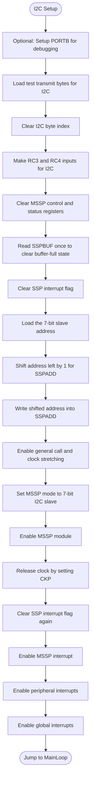
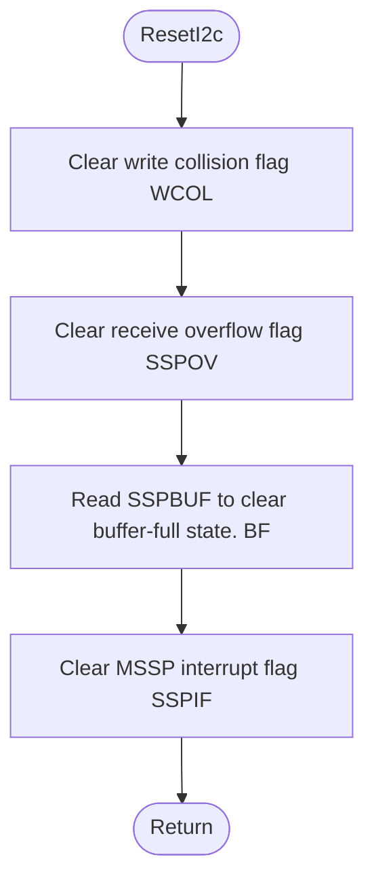
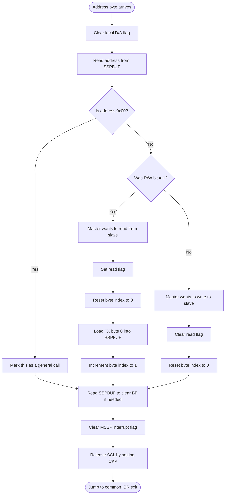
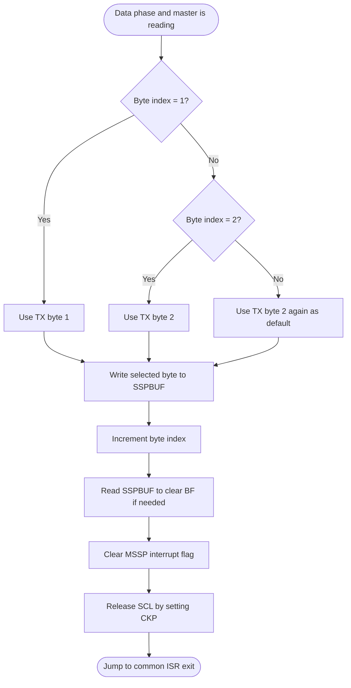
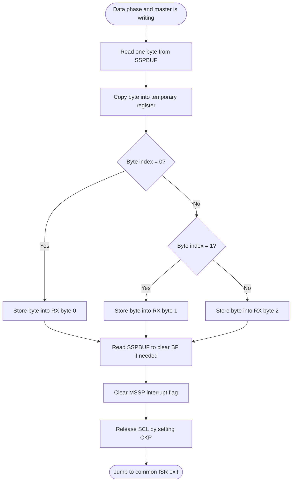
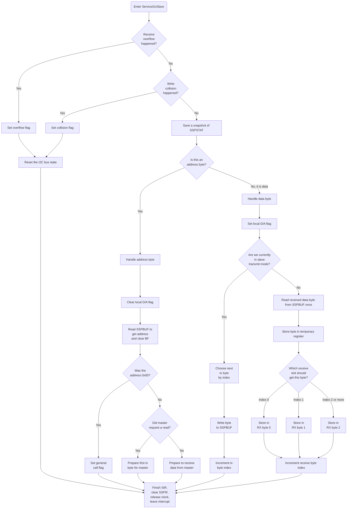

## Setup

## Example: Reset I2C Bus State 
If collision, overflow, buffer-full, or MSSP interrupt flags are set I2C communication iss not possible.

## Address Phase

## Data-byte path when master reads from slave

## Data-byte path when master writes to slave

## Full I2C Slave ISR

.

.

