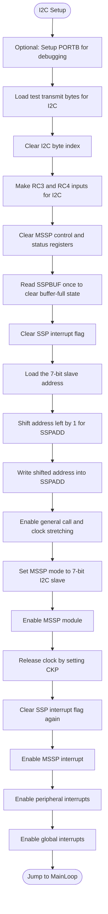
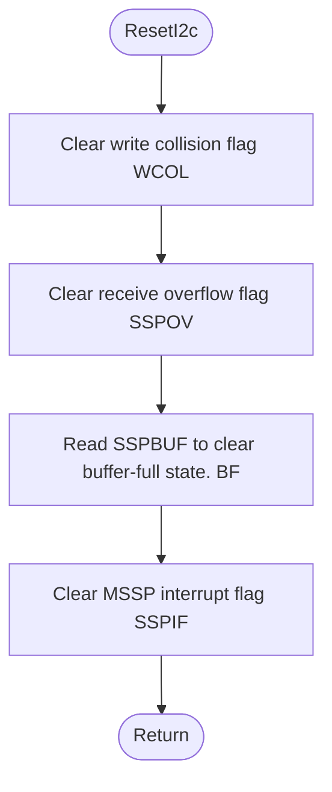
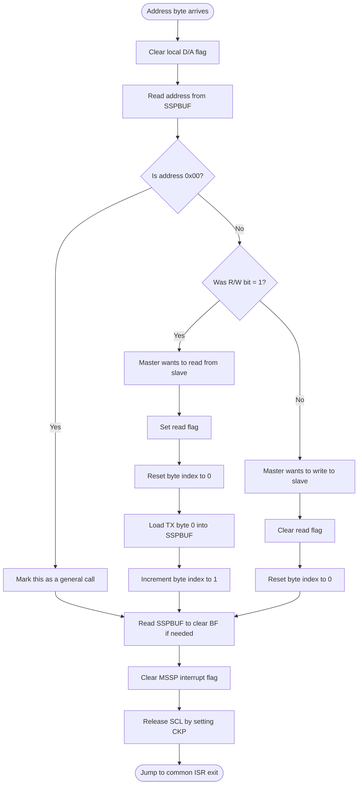
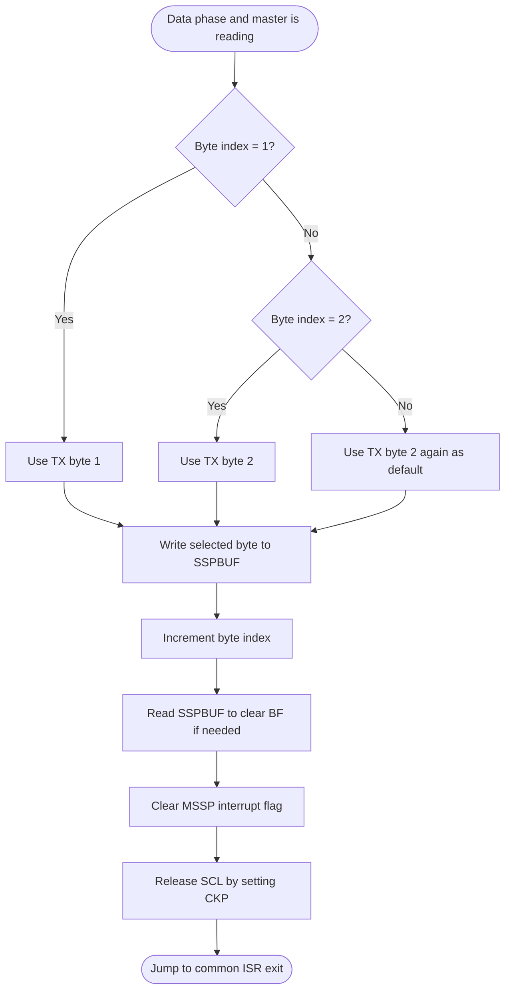
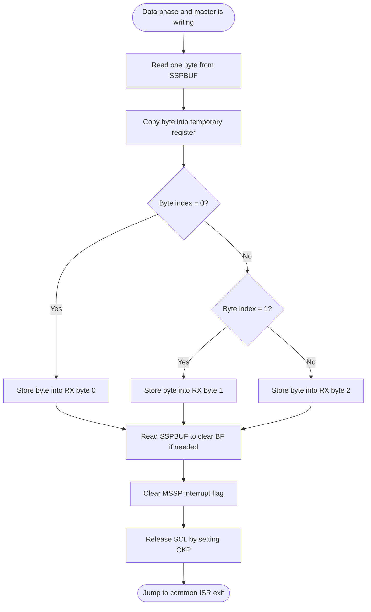
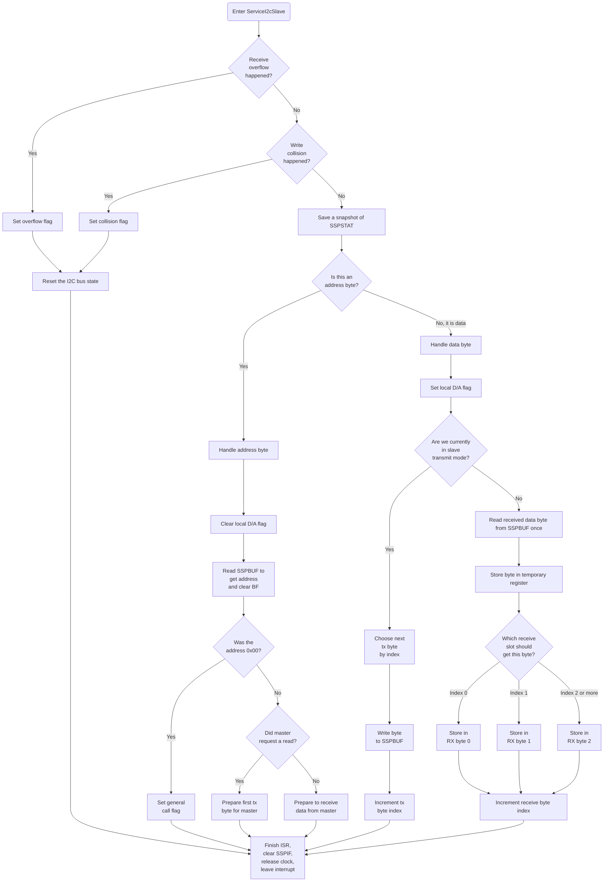

## Setup

[Open this diagram in Mermaid Live Editor](https://mermaid.live/edit#pako:eNp9lF1v2jAUhv_Kka82CS72IU3iYlKBrdqAQgmUtmMXTnwSrDp25Njbqqr_vScnw6BtWm6ixO9zPt5j-0kUTqEYidK4n8VB-gCb6d4CPRevvu3Fl7cTyDDEZi--v4bh8COM6e-yCdpZaUb9GqyW680YSudBYR6rStuK9HvbBxozd0nc3EkFAdsAwUvb1jpA_kjfjFIqhjrkkpEZIRODktdYCdoq_HUWe8bCOQkX8gFhPXkH0ip6vydpE8PfoedMLFLoRZatoHA2eGeYbYMMsQWPlW4D-jaRCyaviFwj9UHcePsZnC0QgoOCo-WxLNEPy2gMB8JEXzG9THm7tNpSAh-bAKWR55YtWbxKlh0QPgxzsqs18geCVMpje6psxfJrkmcHXYbjOhgsO4fhDbtAGS-m0wRdM7QmaOc1Wdt2KKoEU3HunOmpNVMZUZ-szA1ChRa9NFBI0_tXGFc8UPMeQ3E47oQOzRjddFVi6H2vafN15vXNdVPmBhOyYWR7ynakojmJtiy64bmQtS3-LoEabzEEKgEms1WS37B8959BgKyktgnYMXD7RxEJOTPnlpV3J2WDXjcH9ifpT2O7Y_n9mZfG5f-W3rP0gs_k11g3nWkLKnLuHB_NvRUDUaOvpVZi9CRox9TdsVZYymiCeB4IGYPLHm0hRsFHHIjYKNqfUy0rL-vjT1Q6OL_o7wS-Gp5fAKqXS1k)

```mermaid
flowchart TD
    A(["I2C Setup"]) --> B["Optional: Setup PORTB for debugging"]

    B --> G["Load test transmit bytes for I2C"]
    G --> K["Clear I2C byte index"]

    K --> L["Make RC3 and RC4 inputs for I2C"]
    L --> M["Clear MSSP control and status registers"]
    M --> N["Read SSPBUF once to clear buffer-full state"]
    N --> O["Clear SSP interrupt flag"]

    O --> P["Load the 7-bit slave address"]
    P --> Q["Shift address left by 1 for SSPADD"]
    Q --> R["Write shifted address into SSPADD"]

    R --> S["Enable general call and clock stretching"]
    S --> T["Set MSSP mode to 7-bit I2C slave"]
    T --> U["Enable MSSP module"]
    U --> V["Release clock by setting CKP"]
    V --> W["Clear SSP interrupt flag again"]
    W --> X["Enable MSSP interrupt"]

    X --> Y["Enable peripheral interrupts"]
    Y --> Z["Enable global interrupts"]
    Z --> AA(["Jump to MainLoop"])
```

## Example: Reset I2C Bus State 
If collision, overflow, buffer-full, or MSSP interrupt flags are set I2C communication iss not possible.

[Open this diagram in Mermaid Live Editor](https://mermaid.live/edit#pako:eNpF0E1rwzAMBuC_InTaIN1hxxwGS9JAYaVj2cdh2cGz5dbgxEWRW0bpf1_isMxH2Y9eSxfUwRDmaH0464Nigdeq7WE8jzefLb7QQLK51y1-3cJq9QDFWCw9KYYzOyHQwXs3uNCD9WoPH-XuaXw7dyiSKBfBpMmdCMKJeMqbSdM8794XUyZTpWhlpsvirQYJoFOL72gt8cpG72EQJXQHRb3gKuH1ErgdObheiDkeZYnb_It1EvU8qkTup0HbHjPsiDvlDOYXlAN1044MWRW94DVDFSU0P73GXDhShvFoxs9UTu1ZdX9FMk4Cb-cFpz1ffwFTtHRc)

```mermaid
flowchart TD
    A(["ResetI2c"]) --> B["Clear write collision flag WCOL"]
    B --> C["Clear receive overflow flag SSPOV"]
    C --> D["Read SSPBUF to clear buffer-full state. BF"]
    D --> E["Clear MSSP interrupt flag SSPIF"]
    E --> F(["Return"])
```
## Address Phase

[Open this diagram in Mermaid Live Editor](https://mermaid.live/edit#pako:eNqFk19v2jAUxb_KlZ82iarpK9I2QdJS_ooSpm5q9uDGF7CW2MhxChXiu_fmBryWTVqUhzj5nXOPr3MPIrcKRVesCrvLN9J5WCaZAbp6n54y0VPKYVXB86tHkM7pF6wy8eszXF19hT4BcYHSQWFzWUBy3YNVIdcEtBZ9xmLCFigVyJPZytkS0nTe_34X0JjR5JCJYRXAaB9F3zJxzEwLJQRBJn42GZi_JeupdL_BbzTJ6IY1GnQUhgIVwf2W6YcPLjN7MhlQ0UfSLq4f4Vl7-AI3bdEGHlyWvOeSlUcHO2l8Bd6Ca3bHu6oK-YKh7OCi0vAf2p3T1Fp6-CNtxfcsGZEkRX8q8b65I_4-5uZWRPARaaNw37hFgRszNyFuYslj-aMlI2KJuziGCcNTgocmd1iiuTS-Cez03NR2OeTlLPwTfyeeMTH_b-J5a3z-bdqIDZKzcf8O9AoMokIVNA-sWYTqU1I1O0Tn6q3_mGPBbMr-BFcIaTyhNEChvDZriMfzAKcML5thGNXllmPYsrQGhukCcK99Mw-ZER1RoiulVqJ7EH5DvaOxUriSdeHFsSNk7W36anLR9a7Gjqi3SnpMtFw7WZ5fotLeumk7kzyaxzeqixZB)

```mermaid
flowchart TD
    A(["Address byte arrives"]) --> B["Clear local D/A flag"]
    B --> C["Read address from SSPBUF"]
    C --> D{"Is address 0x00?"}

    D -- "Yes" --> E["Mark this as a general call"]
    E --> Q
    D -- "No" --> G{"Was R/W bit = 1?"}
    G -- "Yes" --> H["Master wants to read from slave"]
    G -- "No" --> I["Master wants to write to slave"]

    H --> J["Set read flag"]
    J --> K["Reset byte index to 0"]
    K --> L["Load TX byte 0 into SSPBUF"]
    L --> M["Increment byte index to 1"]
    M --> Q

    I --> N["Clear read flag"]
    N --> P["Reset byte index to 0"]
    P --> Q["Read SSPBUF to clear BF if needed"]
    Q --> R["Clear MSSP interrupt flag"]
    R --> S["Release SCL by setting CKP"]
    S --> T(["Jump to common ISR exit"])
```

## Data-byte path when master reads from slave

[Open this diagram in Mermaid Live Editor](https://mermaid.live/edit#pako:eNpdkk1PwzAMhv-K5RNI4zCOkwDRln3wJVg3AaIcTONtkdp0SlPBNO2_4yZbJdqbq-d9EjveY14pxhGuiuon35B1sEgyA_Ldnn1mmJAj2G6oZiCjoKTasQVdg2VS2qwz_DqHi4triPYZRjvHoI3iX7iC4U2Gh2CKhIAMP7jO0MOxmJeiXLzDd5sZiuYf-lwdyaSvvQzaQCd98V1PfNmJk5543CeB1qQNUA2KV9QUzkdDOPaRiUTerBa45oJzxypEXQVp-hItx91hd4EPxfhUhHLiy6m4Zia3XLJxQeM77BRTj70KNpdJHw9oj8oLJgvRGPQKDLNi1WVefWYumdhDT5ISrbyYbbYOVgWtO3bu2dT7BZZJpPGjXER6c04eFuKHlw5OPbxoF-K-Kbf-GlVZVgZm6Rz4V7fDOs8MDrBkW5JWONqj20h3slrHeeJhgNS4Kt2ZHEfONjzAZqvIcaJpbak8_WSlXWWfwl769Tz8AaIjylQ)

```mermaid
flowchart TD
    A(["Data phase and master is reading"]) --> B{"Byte index = 1?"}
    B -- "Yes" --> C["Use TX byte 1"]
    B -- "No" --> D{"Byte index = 2?"}

    D -- "Yes" --> E["Use TX byte 2"]
    D -- "No" --> F["Use TX byte 2 again as default"]

    C --> G["Write selected byte to SSPBUF"]
    E --> G
    F --> G

    G --> H["Increment byte index"]
    H --> Q["Read SSPBUF to clear BF if needed"]
    Q --> R["Clear MSSP interrupt flag"]
    R --> S["Release SCL by setting CKP"]
    S --> T(["Jump to common ISR exit"])
```
## Data-byte path when master writes to slave

[Open this diagram in Mermaid Live Editor](https://mermaid.live/edit#pako:eNp9kl1L7DAQhv_KMFdHWEG9XPCIba3fB21XUIwXsZnuBjZJSafosux_P2miRfbC3qU8z7zT9N1i4xThHNu1-2hW0jMsCmEhPOd_XgUWkiV0K9kTSKvAyJ7Jg-7hw2vWdinw7QAOD_9CFuCKpAJnCd43TNB6Z6CuH7KnMlBpZhbZPLC56zaJ05YdMJnOeek34Gmpx5DJyaNTbAVmCVf0CadwdCZwJ2xiisCAwBfqBUb8IkTU7Dz9yKie0-FoGv2l_XNfVrkfcvwzpNwPufwl5HgKKfdCrn6xTqKVvItIPwb62jaeDFn-NsJy0_jLhKXD1eTEf5FuH0JAsybpIStBt2CJFKlpwGN0qvGfROg-WONW5P3QMbRruZzYKrJ1nB_g0Io6vwtbQU881gHy24cJriO8GGt0M5guruGMcRau6wroU_PYHmFxhoa8kVrhfIu8Cp8aCqmolcOacTdDObCrN7bBOfuBZjh0SjIVWi69NN8vSelwqfepzbHUu_9Yc97d)

```mermaid
flowchart TD
    A(["Data phase and master is writing"]) --> B["Read one byte from SSPBUF"]
    B --> C["Copy byte into temporary register"]
    C --> D{"Byte index = 0?"}

    D -- "Yes" --> E["Store byte into RX byte 0"]
    D -- "No" --> F{"Byte index = 1?"}

    F -- "Yes" --> G["Store byte into RX byte 1"]
    F -- "No" --> H["Store byte into RX byte 2"]

    E --> Q["Increment byte index"]
    G --> Q
    H --> Q["Read SSPBUF to clear BF if needed"]
    Q --> R["Clear MSSP interrupt flag"]
    R --> S["Release SCL by setting CKP"]
    S --> T(["Jump to common ISR exit"])
```

## Full I2C Slave ISR

.

.

[Open this diagram in Mermaid Live Editor](https://mermaid.live/edit#pako:eNp1VU1T2zAU_CsandqZMA05cmjHSQgxEApx-HYPwn6JNbWlVJIhGYb_3mdJdqIMcEIvu6t9-yT5nWYyB3pCl6V8ywqmDFmMU0HwL_qW0lNhQJEE1CvPIB5kScleIaXfydHRTzJ8T-kcMuBYsgz5CqrRcauCrdcgIP-V0g9XGSKNpPQRdEqtwug5pQmYjkiWJVul9I-Djyxm_NzsohFlCiDxYEReak20YQY6pBe-kl73FJ3dK268r0yWJddcis-MudrpobWJt9ZxQ28T5y0gd9ufNVwMijCiBVvrQmKLS5Ik18kiWlgNRzyz8Cm6jTW2xzVhgrifWJ4r0Jq8bA3sEpwe2oxxqykTeQkBo_M5ba31CDcEN8iZYZ57vuM21R3RUWMLukDQqASmSCkzVpLxjyhM4sLCLu2UWN40ObydECN9HyvMsHXmOxM5yazicNKpXFqVWTM3pu2kwxj6m35_F8PsMIYrP60VzlWx0o-dlWXo9cqCfyN4wgXXBYmTec-DrSN0H098RQGWNOAvMvvra1jBsfLmVqh6bTrh2cEJuMZGxjwnFdPNBWoF_9WgMQ78jwWn7_qwnxu0eK1gzRSQJVdIMhsHtVMiS6m8dmfhxvUWCHZ-5nt6OBq1f2vd8JdKVoeS81bSLc_tMvFRf3EcEgtaYP8R7vWG8dVKgTDl1qfABdHNK-KXRjGhKzybFb5D-5ksDjO5bU5iISWORMDGtPyNO7fCZYPyOWw6N7eWeffsn4M9KKbgjmqHvbPYe8TGIlNQoekudRt6KH0fhrM4SPyhvRA-63x3x1zW_qJIke1u64OlPjYJG6mg3ZYYqNZSMbVFtRUPZvRoKU_NxSl4VoSj1SW-PPj81GW-dx3tQ7N7V9wPT85_3PRI-r6JKOqscI-bPzhX_c5BwDxumcM9Jgmpx59TB6Q51MhoJUZfbj7Ye6aiyKHHweB8DJ8NLhp6gl-OwuU4nGu3pD1agaoYz-nJO8UXqmo-mzksWV0a-tGjrDYy2YqMnhhVQ4_Wa5w4jDlbKVa1Rcg5djRz31z76f34D7C2NtA)

```mermaid
flowchart TD
    A("Enter ServiceI2cSlave") --> B{"Receive
    overflow
    happened?"}
    B -- "Yes" --> C["Set overflow flag"]
    C --> D["Reset the I2C bus state"]
    B -- "No" --> E{"Write
    collision
    happened?"}

    E -- "Yes" --> F["Set collision flag"]
    F --> D
    E -- "No" --> G["Save a snapshot of SSPSTAT"]

    G --> H{"Is this an 
    address byte?"}
    H -- "Yes" --> I["Handle address byte"]
    H -- "No, it is data" --> J["Handle data byte"]

    I --> K["Clear local D/A flag"]
    K --> L["Read SSPBUF to 
    get address 
    and clear BF"]
    L --> M{"Was the 
    address 0x00?"}
    M -- "Yes" --> N["Set general
    call flag"]
    N --> O["Finish ISR,
    clear SSPIF,
    release clock,
    leave interrupt"]
    M -- "No" --> P{"Did master 
    request a read?"}

    P -- "Yes" --> Q["Prepare first tx
     byte for master"]
    Q --> O
    P -- "No" --> R["Prepare to receive
     data from master"]
    R --> O

    J --> S["Set local D/A flag"]
    S --> T{"Are we currently 
    in slave 
    transmit mode?"}

    T -- "Yes" --> U["Choose next 
    tx byte
    by index"]
    U --> V["Write byte
    to SSPBUF"]
    V --> W["Increment tx
    byte index"]
    W --> O

    T -- "No" --> X["Read received data byte from SSPBUF once"]
    X --> Y["Store byte in temporary register"]
    Y --> Z{"Which receive
    slot should 
    get this byte?"}

    Z -- "Index 0" --> AA["Store in
    RX byte 0"]
    Z -- "Index 1" --> AB["Store in 
    RX byte 1"]
    Z -- "Index 2 or more" --> AC["Store in
    RX byte 2"]

    AA --> AD["Increment receive byte index"]
    AB --> AD
    AC --> AD
    AD --> O

    D --> O
```